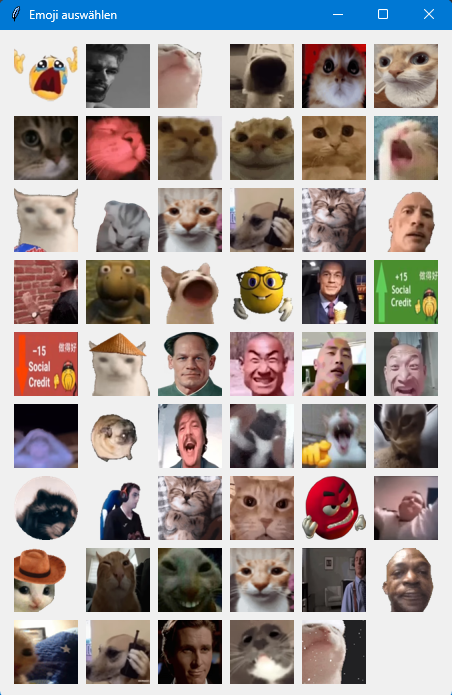
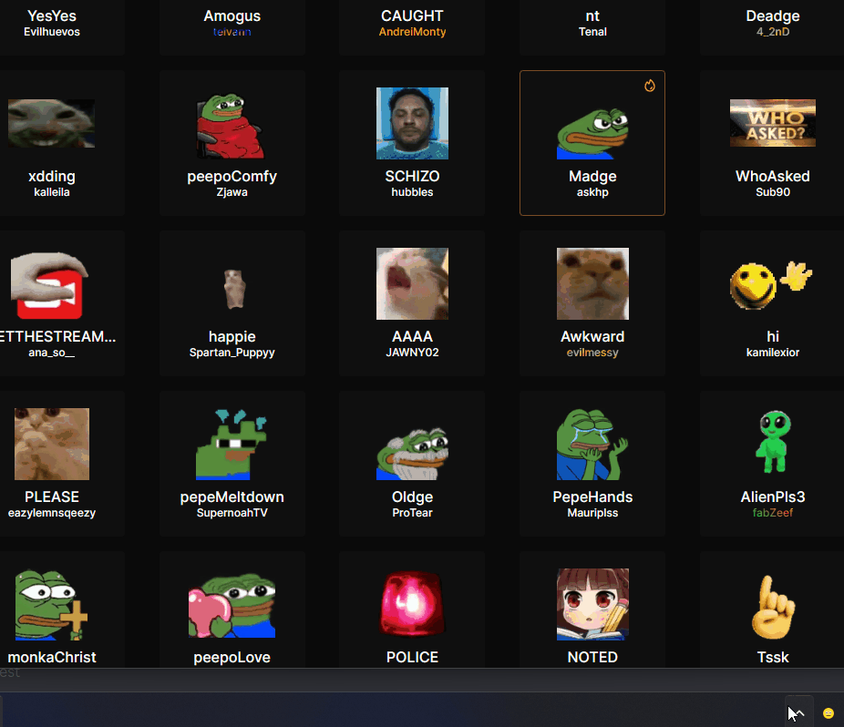

# EmojiPickerDiscord

A small Windows system-tray app that lets you pick a custom emoji (image URL) from a grid and paste it into the currently active app (e.g., Discord) using a global hotkey.
I tried to keep it lightweight (around 16 MB background RAM usage). Previews are loaded on demand.
It runs headless (no main window) and lives in the notification area/tray.

## Features

- System-tray icon with menu
- Global hotkey to open the emoji picker (default: `Ctrl+Shift+E`)
- Add / delete emoji entries (each emoji is stored as an image URL + optional name)
- Hover animations for animated emojis (frames are cached as PNG previews)
- Local caching for faster loading (original downloads + preview frames)
- Prevents “double start” on Windows via a mutex

After startup, the UI window stays hidden and the app appears in the Windows tray.

## Usage

- Press the global hotkey to open the picker at your mouse position.
- Click an emoji to automatically paste it into the currently focused text field; the URL is also copied to the clipboard so you can paste it (`Ctrl+V`).
- Right-click an emoji inside the picker to delete it.

Tray menu:
- **Emoji auswählen**: open picker
- **Emoji hinzufügen**: add an emoji URL (I mostly use https://7tv.app/emotes)
- **Hotkey ändern**: change the global hotkey
- **Ordner öffnen**: open the app data folder
- **Beenden**: quit






## Configuration

The app stores its config in your user AppData folder:

- `%APPDATA%\EmojiPickerDiscord\config.json`

Example format:

```json
{
  "hotkey": "ctrl+shift+e"
}
```

You can edit the file manually, or use the tray menu **Hotkey ändern**.

## Data & Cache Location

All runtime data is stored under:

- `%APPDATA%\EmojiPickerDiscord\`

Files/folders:

- `emojis.json` – your emoji list (URLs + optional names)
- `emoji_cache\` – raw downloaded emoji files (by URL hash)
- `emoji_preview_cache\` – generated PNG preview frames (including animation frames)

On first run, if no `emojis.json` exists yet, the app seeds a default list.

## Disclaimer

This project automates clipboard and keyboard input. Use it at your own risk.
